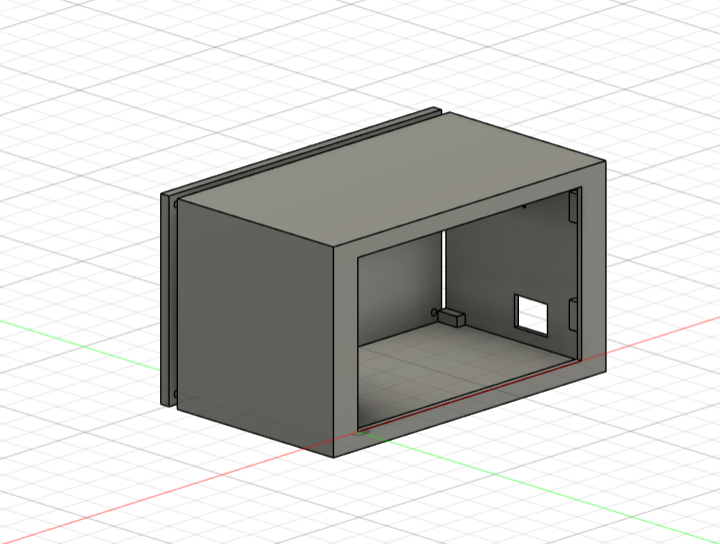
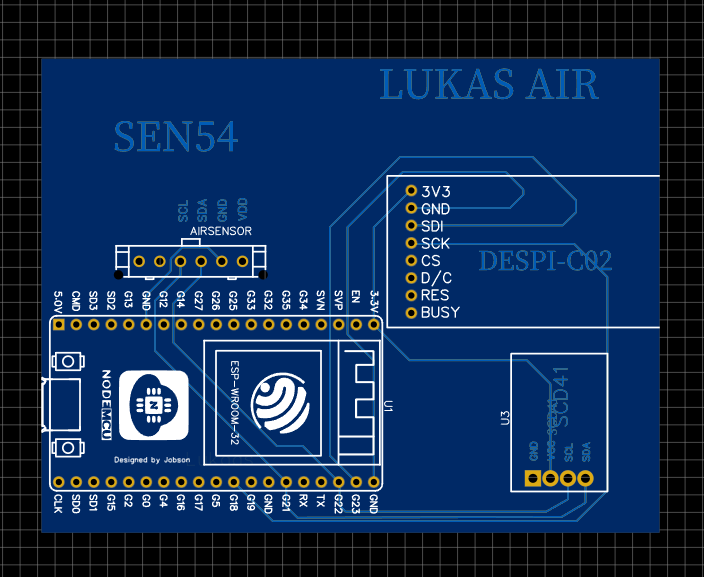
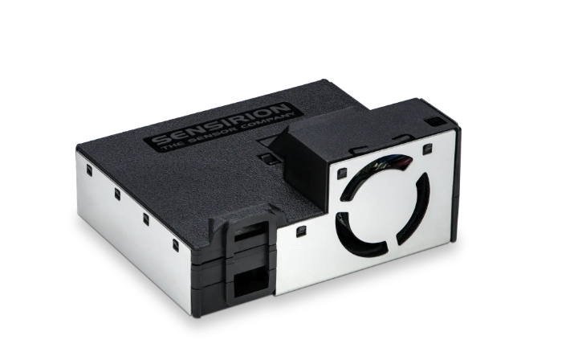
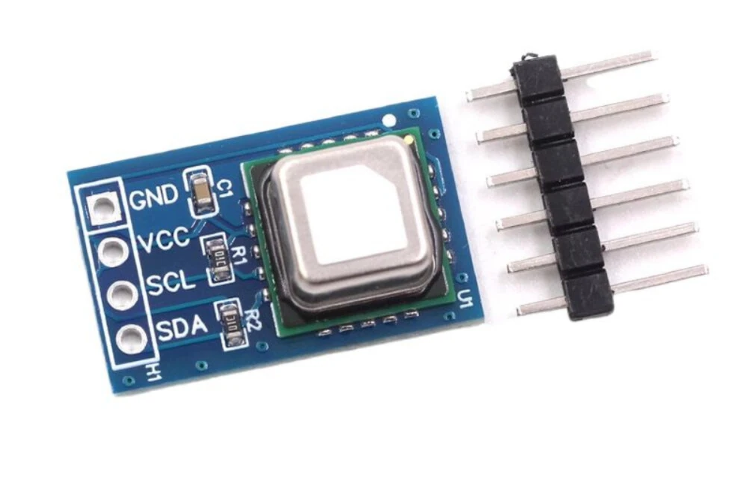

# 🌬️ Air Quality Monitor Project

This is my custom air quality monitoring device based on the ESP32-WROOM-32 microcontroller and a 3.7" e-ink display.  
The device measures indoor air quality parameters such as CO₂, particulate matter, VOC, and NOx, and displays the data on a low-power e-ink screen.

---

# 📐 Screenshot: Schematic

---

# 🟩 Screenshot: PCB

---

# 🧱 Screenshot: Case and Component Fit

---

# 🌡️ Sensors Used

## Sensirion SEN54
- PM1.0, PM2.5, PM4.0, PM10
- VOC index
- NOx index

## Sensirion SCD41
- CO₂
- Temperature
- Relative humidity

---

# 📦 BOM – Bill of Materials

| Quantity | Name | Description | Approx. Price | Link |
|----------|------|-------------|---------------|------|
| 1× | ESP32-WROOM-32 | Main microcontroller | 5€ | [link](https://www.aliexpress.com/item/1005008513246359.html?spm=a2g0o.productlist.main.6.cd7e6e3dxKBsCb&algo_pvid=5a4f399f-1643-4d90-94f0-88e66494cefc) |
| 1× | Sensirion SEN54 | PM/VOC/NOx air quality sensor | 26€ | [link](https://www.soselectronic.com/sk-sk/products/sensirion/sen54-sdn-t-370015?currency=EUR&vat=1&gad_campaignid=20312377350) |
| 1× | Sensirion SCD41 | CO₂/temperature/humidity sensor | 19€ | [link](https://www.aliexpress.com/item/1005009897956849.html?spm=a2g0o.productlist.main.7.49fd3148vlSDSL&algo_pvid=45946307-b2cd-47bb-bba6-12fd41264768) |
| 1× | 3.7" E-Ink Display | 416×240 e-ink panel | 20€ | [link](https://buy-lcd.com/products/37-inch-416x240-e-paper-black-and-white-spi-fast-refresh-electronic-eink-display-screen-esl-gdey037t03?VariantsId=10347) |
| 1× | Custom PCB | Pcb for project | Variable | [link](jlcpcb.com) |
|      | TOTAL |  | 70€=85$ |  |

---

# 🛠 Tools Used

- Fusion 360 – case design  
- EasyEDA – schematic and PCB design  
- Arduino IDE – firmware development  
- GitHub – version control and documentation  
